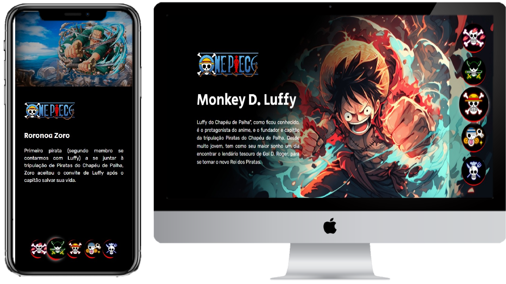

[Projeto ONLINE, experimente agora](https://anderdev-github.github.io/one-piece-landing-page/)  

<h3 align="center">
  Seja bem-vindo ao meu projeto One Piece - Personagens!
</h3>

 

  <a href="#house-sobre-o-projeto">Sobre o projeto</a>&nbsp;&nbsp;&nbsp;|&nbsp;&nbsp;&nbsp;
  <a href="#gear-funcionalidades">Funcionalidades</a>&nbsp;&nbsp;&nbsp;|&nbsp;&nbsp;&nbsp;
  <a href="#man_shrugging-como-funciona">Como Funciona</a>&nbsp;&nbsp;&nbsp;|&nbsp;&nbsp;&nbsp;
  <a href="#open_book-como-usar">Como Usar</a>&nbsp;&nbsp;&nbsp;|&nbsp;&nbsp;&nbsp;
  <a href="#zap-tecnologias">Tecnologias</a>&nbsp;&nbsp;&nbsp;|&nbsp;&nbsp;&nbsp;
  <a href="#balance_scale-licença">Licença</a>&nbsp;&nbsp;&nbsp;|&nbsp;&nbsp;&nbsp;
  <a href="#man_technologist-autor">Autor</a>&nbsp;&nbsp;&nbsp;|&nbsp;&nbsp;&nbsp;

 

 

## :house: Sobre o projeto

Este é um projeto simples em HTML, CSS e JavaScript que apresenta informações sobre alguns personagens do anime e manga One Piece. Você pode selecionar um personagem na lista de botões para ver informações detalhadas sobre ele.

## :gear: Funcionalidades

O projeto possui as seguintes funcionalidades:

1. Seleção de Personagem: Quando você clica em um dos botões na lista, o botão correspondente é destacado como "selecionado", e as informações do personagem são exibidas na tela.

2. Remoção de Seleção: Se você já selecionou um personagem anteriormente, a seleção é removida automaticamente quando você seleciona outro personagem.

## :man_shrugging: Como Funciona

O projeto utiliza JavaScript para adicionar e remover a classe "selecionado" nos botões e nos elementos de personagem correspondentes. Isso permite que os estilos sejam aplicados para indicar qual personagem está selecionado e qual está sendo exibido.

## :open_book: Como Usar

1. Clone este repositório ou baixe os arquivos para o seu computador.

2. Abra o arquivo index.html em um navegador da web.

3. Clique nos botões com as imagens dos personagens na parte inferior para selecionar um personagem e ver suas informações.

## :zap: Tecnologias

-  : Contém a estrutura HTML do projeto, incluindo os botões de seleção e as informações dos personagens.
-  : Define a aparência e o estilo do projeto.
-  : Contém o código JavaScript que controla a interatividade do projeto, como a seleção de botões e exibição de informações de personagem.

## :balance_scale: Licença

Este projeto é de código aberto e está sob a licença Licença MIT. Você é livre para usar, modificar e distribuir este projeto de acordo com os termos da licença.

## :man_technologist: Autor

Feito com ♥ por Anderson Leite :wave: [Entre em contato!](https://www.linkedin.com/in/andersondiasleite/)
